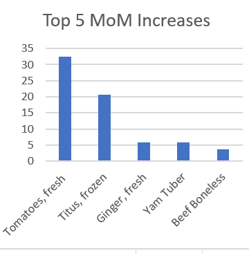
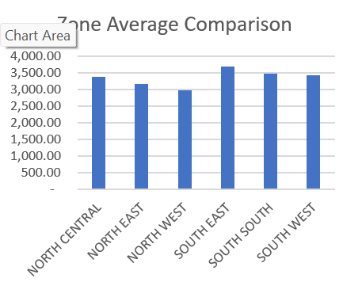
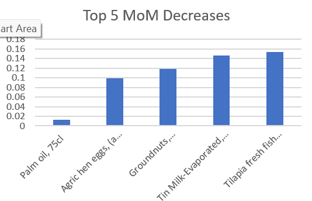

# Nigeria Food Price Analysis — May 2026

An Excel-based analysis of Nigeria's food price trends and regional disparities, using official data from the National Bureau of Statistics (NBS) Selected Food Price Watch report.

## Project Overview

This project analyzes real government data to answer:

- Which food items saw the sharpest month-on-month (MoM) and year-on-year (YoY) price changes?
- Did any items actually get cheaper month-on-month in May 2026?
- Which of Nigeria's six geopolitical zones has the highest/lowest average food costs?
- Which items show the widest price gap between the cheapest and most expensive zone?

## Data Source

- **Source:** [National Bureau of Statistics (NBS) Nigeria](https://nigerianstat.gov.ng) — Selected Food Price Watch, May 2026
- **File:** `Nigeria_Food_Price_Analysis_May2026.xlsx`
- Contains 42 food items with average prices for May 2025, April 2026, and May 2026, plus MoM/YoY % change, state-level highest/lowest prices, and a full 6-zone regional price breakdown.

## Methodology

Built entirely in Excel using:
- **Formula-driven ranking** (`LARGE`, `SMALL`, `INDEX`/`MATCH`) to identify top price movers without manual sorting — updates automatically if source data changes
- **Conditional formatting** (color scales) to visually flag price increases vs. decreases
- **Cross-zone comparison formulas** (`AVERAGE`, `MAX`/`MIN`) to rank regional cost differences
- **Column charts** to visualize the top findings

## Key Findings

- **Fresh Tomatoes** recorded the sharpest MoM increase (~32.5%), likely reflecting seasonal supply disruption.
- **No food item recorded an actual MoM price decrease** in May 2026 — even the most stable items (e.g. Palm Oil, +0.01%) still rose slightly, pointing to broad-based short-term inflationary pressure.
- Despite this, several staples fell sharply **year-on-year**, including Beans Brown (-43.6%) and Garri White (-39.4%).
- A clear **North-South divide** in food costs: North Central, North East, and North West zones consistently show lower average prices, while South East, South South, and South West are consistently higher — likely reflecting the North's role in agricultural production versus the South's greater reliance on transported goods.

## Visuals





 

## Project Structure

```
├── Nigeria_Food_Price_Analysis_May2026.xlsx   # Full workbook with formulas, dashboard, charts
├── visuals/
│   ├── top5_mom_increases.png
│   ├── zone_average_comparison.png
│   └── smallest_mom_increases.png
└── README.md
```

## How to Use

Download `Nigeria_Food_Price_Analysis_May2026.xlsx` and open it in Excel. The `Dashboard` sheet contains the summary tables and charts; the `Analysis` and `Zone All item` sheets contain the underlying formulas.

## Tools Used

Microsoft Excel (formulas, conditional formatting, charts)
